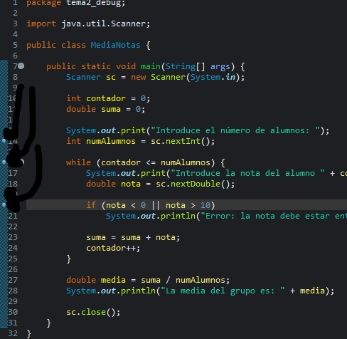
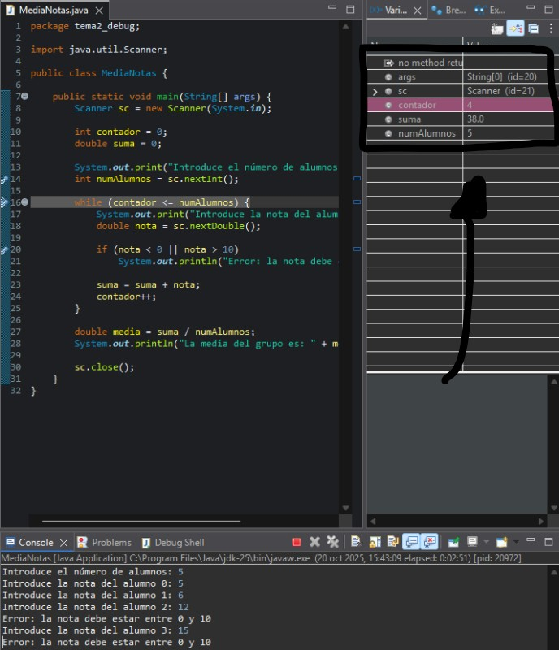
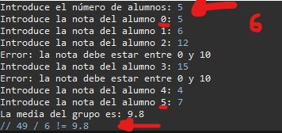
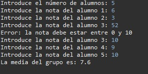
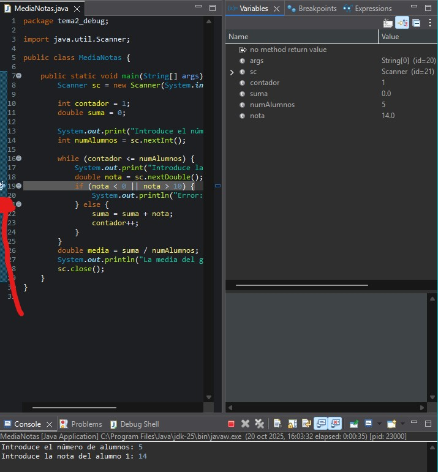
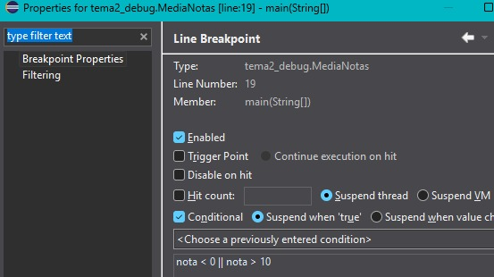
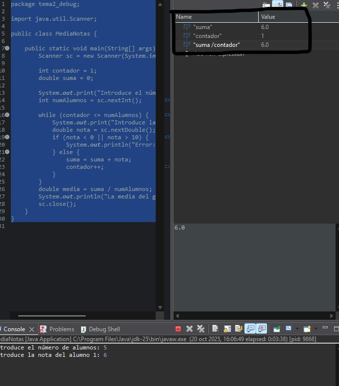
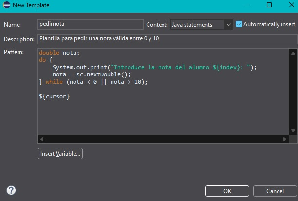
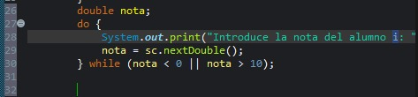

# PR-Eclipse-03-Debug

## 1 Descripción de errores
En primer lugar el programa cuenta de manera errónea los alumnos, ya que la variable contador se inicializa valiendo 0 en vez de 1, lo que provoca que se tome en cuenta a un alumno de más de los que introduce el usuario, además afectando a la media ya que se obtendrá un valor de más.
Luego pude observar que el programa tenía un error lógico ya que al dar el mensaje de error al usuario de que la nota es incorrecta no ocurre nada y este lo toma como si fuese un valor correcto.

## 2 Proceso de detección de errores
El primer error lo detecté usando un breakpoint en el bucle while, lo que, usando la vista de las variables del modo de depuración pude observar el problema de que se empezaba a contar desde el alumno 0 en vez de 1.
El segundo error lo detecté ya que en el modo depuración ví como la variable suma tomó como válido el dato fuera de rango introducido.

## 3 Cambios realizados en el código
Primero he cambiado la inicialización de la variable contador para que empiece por 1, evitando así el primer error.
Para el segundo veo varias soluciones, aunque me he decantado por introducir el código para que la variable suma obtenga las notas y que contador sume su valor dentro de un else que se ejecutará siempre y cuando el valor introducido esté dentro del rango.

## 4 Uso de un breakpoint condicional
Como se puede observar en la siguiente imagen se ha creado un breakpoint para que se dispare si la nota se sale del rango.

## 5  Utilización de expresiones en el modo de depuración
Como se puede observar en la siguiente imagen se han creado 3 expresiones que muestran el valor de las variable, suma, contador y media durante la ejecución del programa.

## 6 Utilización de plantilla
Como se puede ver en las siguientes imágenes, se ha creado una plantilla llamada pedirnota que al utilizarse genera el código de la imagen.

